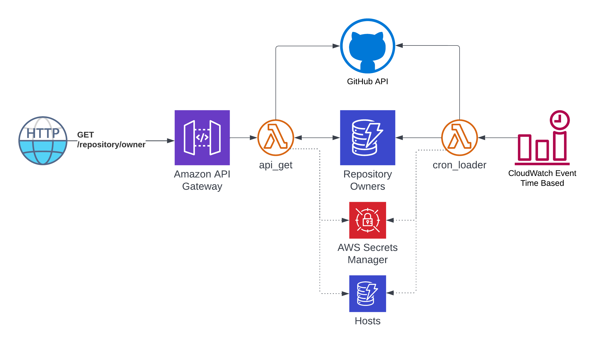

# CodeOwners Manager
This project enables querying of [CODEOWNERS](https://docs.github.com/en/repositories/managing-your-repositorys-settings-and-features/customizing-your-repository/about-code-owners_) data in source code repositories so that it is easily accessible and usable by other services.
In addition to enablement of real time retrieval (GET) operations, this solution caches the results for each call for a specified amount of minutes reducing the load on the GitHub API instances being called, and also contains a background worker that can preload this cache so real time API calls have minimal impact on GitHub itself.

# Supported Source Control Providers
| Name                     | Status    |
|--------------------------|-----------|
| GitHub Cloud             | Available |
| GitHub Enterprise Server | Available |

# Requirements
* Golang 1.18 or higher
* Active GitHub account
* AWS Account for hosting resources

# Components

## Applications
| Name                   | Type                | Description                                                                                                 |
|------------------------|---------------------|-------------------------------------------------------------------------------------------------------------|
| cmd/apiserver          | Web API             | HTTP API server that exposes endpoints for retrieving repository owners                                     |
| cmd/cli                | Console Application | Console application for running functionality locally for from the command line                             |
| cmd/daemon/loader      | Console Application | Console application that scans all organizations for onboarded hosts and saves results to the DynmoDb cache |
| cmd/lambda/api_get     | AWS Lambda Function | Lambda function that exposes an HTTP endpoint for retrieving repository owners                              |
| cmd/lambda/cron_loader | AWS Lambda Function | Lambda function that scans all organizations for onboarded hosts and saves results to the DynmoDb cache     |

## Libraries
| Name              | Type           | Description                                                         |
|-------------------|----------------|---------------------------------------------------------------------|
| internal          | Golang package | Primary functionality for the application                           |
| deployments/infra | Terraform      | Infrastructure definitions for resources needed to run this service | 

## Dockerfiles
| Name              | Description                                                                         |
|-------------------|-------------------------------------------------------------------------------------|
| Dockerfile_api    | Packages the cmd/apiserver application and its dependencies into a Docker image     |
| Dockerfile_loader | Packages the cmd/daemon/loader application and its dependencies into a Docker image |

# Pipelines
All pipelines for this service are performed via GitHub actions

## Build
| Location                             | Name                               | Description                                        |
|--------------------------------------|------------------------------------|----------------------------------------------------|
| .github/workflows/application-ci.yml | application-continuous-integration | Continuous integration build for the golang code   |
| .github/workflows/terraform-ci.yml   | terraform-continuous-integration   | Continuous integration buld for the Terraform code |

## Deploy
| Location                         | Name                 | Description                                                                                                                   |
|----------------------------------|----------------------|-------------------------------------------------------------------------------------------------------------------------------|
| .github/workflows/deploy-prd.yml | terraform-deploy-prd | Executes the Terraform plan and apply process so all infrastructure is created or updated.  Also deploys the lambda functions |

# How to Use
The CodeOwners Manager service can be implemented in your organization by using the following steps:

## AWS Resources
1. Run the Terraform code in the deployments/infra, so it creates the required resources.  This can be done by running the following command from the deployments/infra directory or using the deploy-prd.yml GitHub action targeted at your AWS Account
```shell
terraform apply -input=false -auto-approve -var environment="prd"
```
2. Once the resources are created, the source code hosts to enable querying and scanning on need to be onboarded.  This is done by adding items into the Hosts DyanmoDb table, usually names _codeowners_manager_prd_hosts_
   * Attributes
      * Id: Unique Identifier
      * Authentication Type: How the source code host is authenticated against.  Default is PAT (Personal Access Token)
      * BaseUrl: Base API Url for the host
      * ClientSecretName: Name of the Secret in AWS Secrets Manager where the authentication token is held
      * Name: Friendly name of the host
      * ParentOwnerLinePattern: Pattern of the line in CODEOWNERS file that defines the parent owner
      * Type: Type of host.  Default is source code
      * SubType: Specific Flavor of the host.  Valid values are Github Cloud and Github Enterprise Server
   * Example
```json
{
  "Id": {
    "S": "github.com"
  },
  "AuthenticationType": {
    "S": "PAT"
  },
  "BaseUrl": {
    "S": "https://api.github.com"
  },
  "ClientSecretName": {
    "S": "codeowners-manager/github.com/client-secret"
  },
  "Name": {
    "S": "github.com"
  },
  "ParentOwnerLinePattern": {
    "S": "#GUSINFO:"
  },
  "SubType": {
    "S": "GitHub Cloud"
  },
  "Type": {
    "S": "source code host"
  }
}
```
3. For each host onboarded in the previous step, obtain a Personal Access Token (example: https://github.com/settings/tokens) and save it as a secret using AWS Secrets manager in the account the CodeOwners Manager service is running in.  Be sure that the secret name matches with what is saved in the hosts table.
4. That's it.  Test the Lambda functions and verify logs in CloudWatch to ensure they are functioning correctly

## (Optional) Kubernetes Setup
If you prefer to run the top level applications in your own K8s cluster or have requirements where these services need to run on your own infrastructure, the API and loader can be ran inside of a Kubernetes cluster instead of Lambda functions in AWS.
1. Disable / remove the Lambda functions if desired
2. Build the Dockerfile_api and Dockerfile_loader images and push to a Docker registry
3. Create or update the required Helm charts to use these
   * Note 1: This is not defined in this repository as every organization has their own requirements
   * Note 2: The image created by the Dockerfile_loader is expected to run as a [CronJob](https://kubernetes.io/docs/concepts/workloads/controllers/cron-jobs/) in Kubernetes so it is executed on a regulary basis
4. Deploy

# Development Environment Setup
To run the codeowners-manager code locally, use the following steps to set up your development environment after the code has been pulled down.

## 1. Add Environment Variables
Add the required environment variables:

| Name                             | Description                                                                         | Example Value                            |
|----------------------------------|-------------------------------------------------------------------------------------|------------------------------------------|
| aws_region                       | AWS region to find required AWS resources                                           | us-west-2                                |
| AWS_ACCESS_KEY_ID                | Key for authenticating to AWS resources                                             | {access key for your user}               |
| AWS_SECRET_ACCESS_KEY            | Secret for authenticating to AWS resoruces                                          | {secret key for your user}               |
| AWS_SESSION_TOKEN                | (Optional) Session token for AWS.                                                   | {super secret session token}             |
| codeowners_host_table            | Name of the DynamoDb table containing queryable hosts                               | codeowners_manager_prd_hosts             |
| codeowners_repositoryowner_table | Name of the DynamoDb table that acts as the repository owner cache                  | codeowners_manager_prd_repository_owners |
| codeowners_ttl_minutes           | Time to Live value in minutes for data held in the repository owners DynamoDb table | 180                                      |

## 2. Review the Makefile
This project uses [make](https://www.gnu.org/software/make/) to automate common tasks.  See the Makefile for what is available and run them.

### Build and run unit tests
```shell
make build
make test
```

### Build and run the web api
```shell
make docker_build_api
make docker_serve_api
```

### Build and run the loader daemon
```shell
make docker_build_loader
make docker_serve_loader
```

## 2. Run the application
Use the following sample commands to execute the cli application.  All commands are ran from the cmd/cli context.

### Load Repository Owner Data for a specific organization
```shell
go run main.go -action load -host github.com -organization salesforce
```

### Load Repository Owner Data for all organizations on a specific host
```shell
go run main.go -action load -host github.com
```

### Get Repository Owners for a specific repository
```shell
go run main.go -action get -host github.com -organization salesforce -repository cloud-guardrails
```

### Get Repository Owners for all repositories in a specific organization
```shell
go run main.go -action get -host github.com -organization salesforce
```

### Get Repository Owners for all repositories in all organizations on a specific host
```shell
go run main.go -action get -host github.com
```